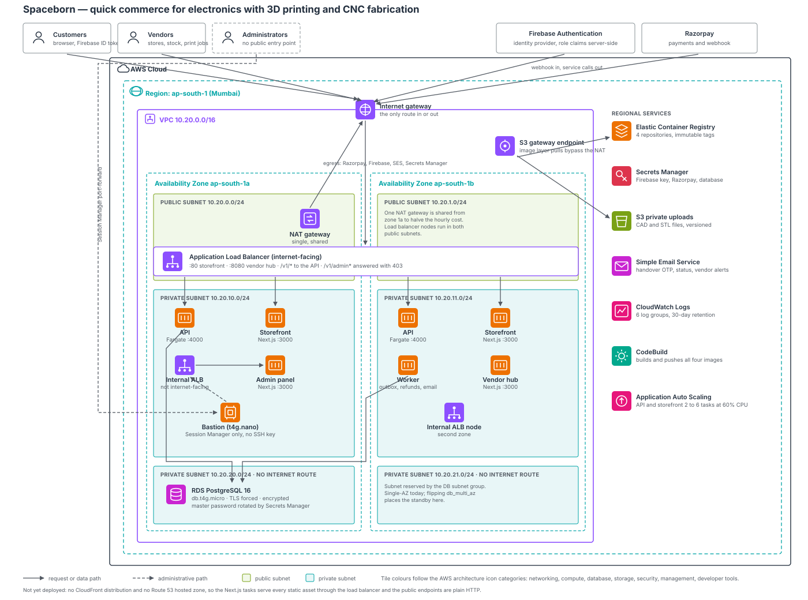
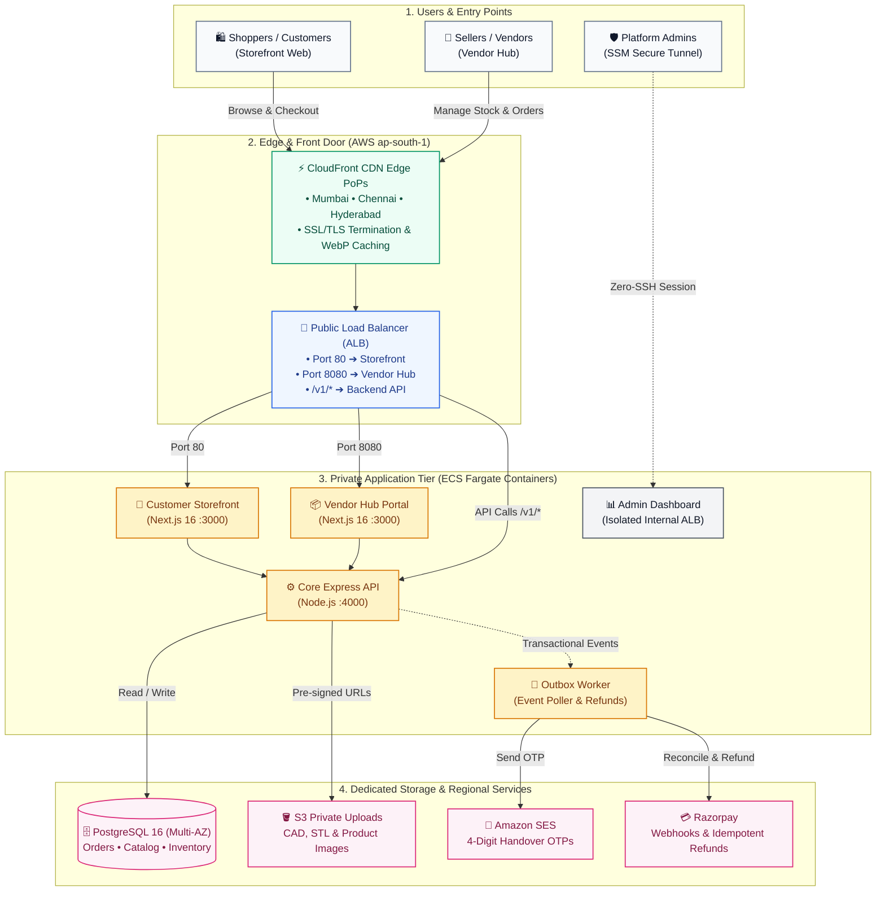

# Spaceborn — Distributed Quick-Commerce & Hardware Fabrication Platform

> **Location-first quick commerce for robotics, embedded electronics, and custom on-demand 3D printing & CNC fabrication.**

[](https://aws.amazon.com)
[](https://nextjs.org)
[](https://www.postgresql.org)
[](https://www.terraform.io)
[](https://www.typescriptlang.org)

---

## 🏛️ System Architecture

Spaceborn is designed as a cloud-native, multi-tier distributed system running in AWS region `ap-south-1` (Mumbai). It enforces a **Zero-Trust network perimeter**, where public ingress is strictly isolated from internal microservices, asynchronous workers, and persistent databases.



---

### 🗺️ Visual Architecture Canvas



---

### 💡 The Architecture Explained in Plain English

| Layer | Component | What It Does (In 1 Sentence) |
|---|---|---|
| **Edge Cache** | AWS CloudFront | Caches product images and Next.js bundles in Mumbai, Chennai, and Hyderabad for **< 15ms page loads**. |
| **Front Door** | Public ALB | Directs customers to the **Storefront**, sellers to the **Vendor Hub**, and data queries to the **API**. |
| **Compute** | ECS Fargate Docker | Runs all 3 Next.js applications and the Express API in private subnets with **no public IPs**. |
| **Admin Shield** | Internal ALB & Bastion | Keeps the Admin Dashboard **physically invisible** from the public internet (accessible only via AWS SSM). |
| **Database** | RDS PostgreSQL 16 | Stores orders, users, and 55 product catalog entries with Multi-AZ failover and auto-rotated secrets. |
| **Workers** | Asynchronous Outbox | Handles 4-digit handover OTP emails via SES and auto-refunds via Razorpay with zero checkout delays. |

---

## 🔒 Key Architectural Pillars

### 1. Dual-ALB Network Segmentation
- **Public Ingress ALB:** Handles public internet traffic across Availability Zones `ap-south-1a` and `ap-south-1b`. Routes customer traffic to the storefront (`:80`), vendor traffic to the vendor hub (`:8080`), and business API calls to `/v1/*`. Any external request hitting `/v1/admin*` is blocked at the ALB listener rule with a strict `403 Forbidden`.
- **Internal Private ALB:** The **Admin Panel** is physically inaccessible from the internet. It resides in the private subnet behind an internal load balancer, accessible only via secure VPC peering, AWS VPN, or via port-forwarding through the SSM-managed bastion host.

### 2. Zero-Trust Access & Bastion Architecture
- **No Public SSH:** The EC2 Bastion (`t4g.nano`) has **no public IP address** and **no open port 22**.
- **IAM Identity-Based Access:** Administrative access is granted exclusively through AWS Systems Manager (`aws ssm start-session`), generating ephemeral credentials audited in AWS CloudTrail.

### 3. Server-Enforced Location-First Routing
- Store selection is **never trusted to the client**.
- Delivery coordinates dictate fulfillment ranking based on real-time inventory, store operating status, and physical proximity to guarantee < 15-minute fulfillment SLAs.

### 4. Resilient Asynchronous Worker & Outbox Pattern
- Transactional mutations write domain events to an ACID **Transactional Outbox Table** within the same PostgreSQL transaction.
- A dedicated background ECS Fargate worker continuously polls and distributes events to:
  - **Amazon SES:** Delivers 4-digit handover OTPs and vendor dispatch alerts.
  - **Razorpay Reconciliation:** Reconciles order payments and handles idempotent auto-refunds on inventory race conditions.

### 5. High-Performance Image Optimization
- Next.js 16 Image Optimization API (`next/image`) dynamically fetches, resizes, and compresses source images to modern **AVIF / WebP** formats.
- CloudFront edge caches static assets (`/_next/static/*`) and image requests, eliminating repetitive backend compute.
- Custom vendor uploads (CAD / STL 3D models and CNC specifications) are streamed directly to private, encrypted S3 buckets via pre-signed URLs.

---

## 📦 Monorepo Directory Structure

```
Spaceborn-E-commerce/
├── apps/
│   ├── customer-storefront/  # Customer quick-commerce shopping web app (Next.js 16)
│   ├── vendor-hub/           # Seller order management & stock management portal (Next.js 16)
│   └── admin-panel/          # Platform telemetry, inventory governance & audit dashboard (Next.js 16)
├── services/
│   └── api/                  # Core REST API & Asynchronous Outbox Worker (Express + Node.js)
│       ├── migrations/       # PostgreSQL schema migrations
│       └── src/
│           ├── db/           # Connection pool & 55-product seed catalog
│           ├── orders/       # Order state machine & fulfillment logic
│           └── payments/     # Razorpay integration & webhook handlers
├── packages/
│   └── web-core/             # Shared TypeScript types, API clients, and UI design primitives
├── ops/
│   └── spaceborn.ps1         # Unified operational CLI (build, test, deploy, migrate)
├── terraform/                # Production AWS Infrastructure-as-Code (ap-south-1)
└── docs/
    └── architecture.svg      # Official AWS Architecture Diagram
```

---

## 🚀 Quickstart & Local Development

### Prerequisites
- **Node.js**: `v20.x` or `v22.x`
- **npm**: `v10.x+`
- **PostgreSQL**: `v16.x` (or Docker)

### 1. Installation
Clone the repository and install dependencies at the monorepo root:
```bash
git clone https://github.com/Spaceborn-Beyond-Autonomous/Spaceborn-E-commerce.git
cd Spaceborn-E-commerce
npm install
```

### 2. Configure Environment
Copy the example environment templates:
```bash
cp services/api/.env.example services/api/.env
```

### 3. Running Services Locally
Start services individually or in parallel using npm workspaces:

| Service | Port | Command |
|---|---|---|
| **Core API Backend** | `4000` | `npm run dev:api` |
| **Customer Storefront** | `3000` | `npm run dev:storefront` |
| **Vendor Hub** | `3001` | `npm run dev:vendor` |
| **Admin Panel** | `3002` | `npm run dev:admin` |
| **Background Outbox Worker**| N/A | `npm run dev:worker` |

---

## 🧪 Testing & Verification

Run the comprehensive TypeScript compilation and test suites:

```bash
# Typecheck all monorepo workspaces
npm run typecheck

# Run domain, fulfillment, and RBAC integration tests
npm test
```

---

## 📜 Infrastructure Governance

The production environment is provisioned with high-availability safeguards:
- **RDS Multi-AZ**: High-availability database replication with automatic failover.
- **Accidental Deletion Shield**: `deletion_protection = true` and `skip_final_snapshot = false` enforced on all persistent databases.
- **Immutable Container Tags**: ECR images are pinned and scanned on push using AWS Inspector.

---
*Built with precision for Spaceborn.*