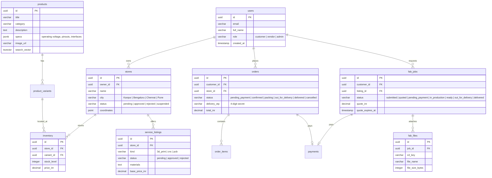

# Spaceborn — Complete System Reference & Technical Manual

> **Master Architecture & Codebase Documentation**  
> Complete technical reference for the next engineering session.

---

## 1. Project Concept & Business Model

**Spaceborn** is a location-first quick-commerce platform engineered specifically for **hardware developers, makers, robotics engineers, and IoT startups**. 

It merges two complementary services into a unified marketplace:
1. **Hyperlocal Electronics Delivery (10–30 Minutes):**
   - Microcontrollers (ESP32, Raspberry Pi, Arduino, STM32).
   - Sensors (IMUs, LiDAR, Ultrasonic, Thermal, Gas).
   - Actuators & Motors (NEMA Steppers, Coreless, Brushless, Servos).
   - Power & Battery Management (LiPo, BMS, Buck-Boost converters, GaN chargers).
2. **On-Demand Digital Fabrication (3D Printing & CNC Machining):**
   - Robu/JLC-style custom manufacturing workflow.
   - Customers upload CAD design files (`.stl`, `.step`, `.dxf`, `.3mf`, up to 50MB).
   - Local vetted maker-workshops evaluate CAD specifications, tolerances, and materials (PLA, ABS, Resin, Carbon Fiber, Aluminum 6061, Brass).
   - Workshops issue INR quotes; customers accept and pay online; finished parts are dispatched to the customer's doorstep with OTP-verified delivery.

---

## 2. Monorepo Structure (npm Workspaces)

```
Spaceborn-E-commerce/
├── apps/
│   ├── customer-storefront/   # Next.js 16 (Port 3000) - Buyer shopping & CAD upload
│   ├── vendor-hub/            # Next.js 16 (Port 3001) - Seller inventory & job quoting
│   └── admin-panel/           # Next.js 16 (Port 3002) - Air-gapped back-office
├── services/
│   └── api/                   # Express 5 + pg (Port 4000) - Core API & Outbox worker
├── packages/
│   └── web-core/              # Shared React components, Firebase Auth, API client
├── terraform/                 # Production AWS IaC (VPC, ECS, RDS, CloudFront, ALB)
├── ops/                       # Operational PowerShell & orchestration scripts
├── docs/                      # Architecture, onboarding, and reference documentation
├── down.sh                    # 1-click Linux/macOS infrastructure wipe
└── down.ps1                   # 1-click Windows infrastructure wipe
```

---

## 3. Database Schema & Persistence (PostgreSQL 16)

The database schema runs on **RDS PostgreSQL 16** with strict relational integrity, foreign key cascades, and check constraints:



---

## 4. Product Catalog (100 Items Across 4 Cities)

The platform includes **100 industrial-grade components** seeded across 4 strategic maker hubs:
- **Kanpur:** IIT Kanpur ecosystem focus (aerospace, sensors, microcontrollers).
- **Bengaluru:** Hardware startup hub (AI accelerators, IoT, ESP32, Raspberry Pi).
- **Chennai:** Robotics & CNC hub (heavy-duty stepper motors, drivers, linear rails).
- **Pune:** Automotive & industrial automation components.

### 4.1 Technical Specification Schema
Every product card includes technical fields modeled after Robu.in:
- **SKU & Model Number**
- **Operating Voltage & Logic Level** (e.g. `3.3V / 5V TTL`)
- **Communication Protocol** (e.g. `I2C, SPI, UART, CAN Bus`)
- **Dimensions & Weight** (e.g. `51 x 28 x 12 mm, 18.5g`)
- **Pinout Compatibility** (e.g. `Breadboard friendly, 2.54mm pitch`)

### 4.2 Search Engine
The catalog uses **PostgreSQL Full-Text Search (FTS)** combined with semantic vector ranking:
- Automatic trigger `update_product_search_vector` on insert/update.
- Supports instant search queries (e.g. `"esp32 wroom"`, `"nema 17 stepper"`, `"lidar sensor"`).

---

## 5. Security & Authentication Architecture

### 5.1 The 3 Distinct Roles
1. **Customer:**
   - Default role assigned upon signing in via Firebase Google OAuth.
   - Access is public via CloudFront CDN or ALB Port 80.
2. **Vendor:**
   - Must be associated with an approved store in `stores`.
   - Access is via Public ALB Port 8080 (`vendor-hub`).
   - Admin and Vendor roles are mutually exclusive on the same email for anti-fraud safety.
   - **Testing Tip:** Use `oumgupta555+vendor@gmail.com`.
3. **Admin:**
   - Platform superuser (`oumgupta555@gmail.com`).
   - Dual-gated: Hardcoded in `DEFAULT_ADMIN_EMAILS` on both frontend (`apps/admin-panel/src/app/page.tsx`) and backend (`services/api/src/auth.ts`).
   - Decoupled from third-party Firebase Admin server keys.
   - Air-gapped: Only reachable via the AWS SSM Bastion tunnel on `http://localhost:8080`.

### 5.2 Defense-in-Depth Network Rules
- **ALB Ingress Filter:** Public ALB explicitly returns `403 Forbidden` for any request matching `/v1/admin/*`.
- **Database Role Enforcement:** Even if a user crafts a valid Firebase JWT, the backend verifies the role against PostgreSQL before executing sensitive operations.
- **Delivery Verification OTP:** The 4-digit handover OTP is kept encrypted and only visible to the customer. The vendor must submit the OTP through `/v1/orders/:id/deliver` to complete the transaction and release payment.

---

## 6. AWS Cloud Infrastructure Reference

| AWS Resource | Identifier / Configuration | Role in System |
| :--- | :--- | :--- |
| **VPC** | `10.20.0.0/16` (`ap-south-1`) | Multi-AZ isolated networking across 3 tiers. |
| **ECS Fargate Cluster** | `spaceborn-dev` | Serverless container execution for all 5 services. |
| **Public ALB** | `spaceborn-dev-public` | Port 80 (Storefront + API), Port 8080 (Vendor Hub). |
| **Admin ALB** | `spaceborn-dev-admin` (Internal) | Port 80 (Admin Panel + Internal API), private subnet. |
| **Bastion Host** | `i-0a2072cfc13d7a3fc` (`t4g.micro`) | SSM-managed secure gateway for Admin port-forwarding. |
| **RDS PostgreSQL** | `db.t4g.micro`, gp3 (Encrypted) | Primary relational database with automated backups. |
| **S3 Uploads Bucket**| `spaceborn-uploads-*` | Private KMS-encrypted bucket for customer CAD designs. |
| **CloudFront CDN** | `d2w4nxdybzrkls.cloudfront.net` | Global edge distribution, HTTPS, and asset caching. |
| **ECR Repositories** | `spaceborn/{api,storefront,vendor-hub,admin-panel}` | Immutable Docker container image registry. |
| **AWS CodeBuild** | `spaceborn-build` | Cloud-native container build pipeline (no local CPU load). |

---

## 7. Operations & Playbook Cheat Sheet

### 7.1 Deployment & Rolling Updates
```powershell
# In PowerShell:
.\ops\spaceborn.ps1 deploy
```
Packages source, uploads to S3, triggers AWS CodeBuild in the cloud, updates task definitions, runs migrations, and executes zero-downtime rolling service updates.

### 7.2 Connecting to Admin
```powershell
.\ops\spaceborn.ps1 tunnel -Target admin
# Then open: http://localhost:8080
```

### 7.3 Pausing (Cost Optimization)
```powershell
.\ops\spaceborn.ps1 stop
```
Scales ECS tasks to 0 and stops RDS and Bastion.

### 7.4 Total Teardown ($0.00 Cost)
```powershell
# On Windows:
.\down.ps1

# On Linux/macOS:
./down.sh
```
Executes `terraform destroy -auto-approve` and deletes all 98 cloud resources.

---

## 8. Past Bug Fixes & Lessons Learned

1. **Bastion SSM `TargetNotConnected`:**
   - Cause: Bastion host was shut down and its IAM instance profile was detached.
   - Solution: Attached `spaceborn-dev-bastion` IAM profile, resized to `t4g.micro`, and configured `ops/spaceborn.ps1 tunnel` to auto-detect and auto-boot the instance.
2. **`grant-admin` Exit Code 1:**
   - Cause: `firebaseAuth.getUserByEmail()` crashed because `FIREBASE_SERVICE_ACCOUNT_JSON` was not in Secrets Manager.
   - Solution: Decoupled role resolution from Firebase server keys by writing directly to PostgreSQL and adding `DEFAULT_ADMIN_EMAILS = ['oumgupta555@gmail.com']`.
3. **S3 Bucket Deletion Failures:**
   - Cause: Non-empty versioned S3 bucket blocked `terraform destroy`.
   - Solution: Added `force_destroy = true` to `aws_s3_bucket.uploads` in `terraform/s3.tf`.
4. **TypeScript `TS2532` in `grant-admin.ts`:**
   - Cause: `rows[0]` could be undefined under `noUncheckedIndexedAccess`.
   - Solution: Added null-safe checking (`rows.length > 0 && rows[0]`).
