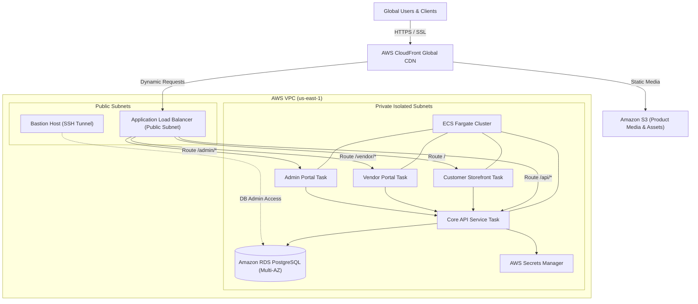

# Spaceborn E-Commerce: Production Engineering Progress & Architecture Report

> **Workspace Reference**: `D:\spacebornecomm\spacebornecomprod`  
> **Target Environment**: Production Deployment (AWS Enterprise Microservices / ECS Fargate)  
> **Git Remote**: `https://github.com/Spaceborn-Beyond-Autonomous/Spaceborn-E-commerce.git` (Branch: `main`)  
> **Last Updated**: October 2026  

---

## 1. Executive Summary & Dual-Environment Strategy

Spaceborn E-Commerce provides an end-to-end commercial platform for autonomous systems, robotics, avionics, and space-grade electronic components. The architecture is engineered around a **dual-repository separation**:

```
D:\spacebornecomm\
├── spacebornecomprod\   <-- (This Repo) Full production AWS microservices infrastructure
├── spacebornecomdemo\   <-- Zero-cost showcase tier running on Render ($0/mo free tier)
└── _backup_Spaceborn-E-commerce\ <-- Historical archive preserving previous local files & node_modules
```

This repository (`spacebornecomprod`) houses the high-availability, auto-scaling production platform designed for enterprise AWS cloud deployment with strict security segmentation, isolated private VPCs, and automated CI/CD pipelines.

---

## 2. Infrastructure as Code (Terraform) Architecture

All production infrastructure is managed via Terraform under [`terraform/`](file:///D:/spacebornecomm/spacebornecomprod/terraform):

| Component Module | Configuration File | Purpose & Architecture |
| :--- | :--- | :--- |
| **Networking & VPC** | [`network.tf`](file:///D:/spacebornecomm/spacebornecomprod/terraform/network.tf) | Multi-AZ VPC with public subnets (ALB, NAT Gateways) and private isolated subnets (ECS, RDS). |
| **Compute / Containers** | [`ecs.tf`](file:///D:/spacebornecomm/spacebornecomprod/terraform/ecs.tf) | AWS ECS Fargate cluster with auto-scaling task definitions for each discrete microservice. |
| **Container Registry** | [`ecr.tf`](file:///D:/spacebornecomm/spacebornecomprod/terraform/ecr.tf) | Amazon ECR repositories for versioned, immutable Docker images. |
| **Load Balancing** | [`alb.tf`](file:///D:/spacebornecomm/spacebornecomprod/terraform/alb.tf) | Application Load Balancer with path-based routing (`/api/*`, `/vendor/*`, `/admin/*`, `/*`). |
| **Database Tier** | [`rds.tf`](file:///D:/spacebornecomm/spacebornecomprod/terraform/rds.tf) | Multi-AZ Amazon RDS PostgreSQL instance with automated backups and encrypted storage. |
| **Content Delivery** | [`cloudfront.tf`](file:///D:/spacebornecomm/spacebornecomprod/terraform/cloudfront.tf) | AWS CloudFront global edge CDN distribution with SSL termination and asset caching. |
| **Storage & Media** | [`s3.tf`](file:///D:/spacebornecomm/spacebornecomprod/terraform/s3.tf) | S3 buckets for product media, CAD/CAM models, and static Next.js export bundles. |
| **Secrets & Config** | [`secrets.tf`](file:///D:/spacebornecomm/spacebornecomprod/terraform/secrets.tf) | AWS Secrets Manager integration for database credentials, JWT secrets, and API keys. |
| **Security Groups** | [`security.tf`](file:///D:/spacebornecomm/spacebornecomprod/terraform/security.tf) | Least-privilege ingress/egress rules enforcing zero direct public internet access to RDS or ECS. |
| **Secure Bastion** | [`bastion.tf`](file:///D:/spacebornecomm/spacebornecomprod/terraform/bastion.tf) | Hardened EC2 Bastion host in public subnet for secure SSH tunnel access to private resources. |
| **Communications** | [`ses.tf`](file:///D:/spacebornecomm/spacebornecomprod/terraform/ses.tf) | Amazon Simple Email Service (SES) integration for transactional emails and order alerts. |

---

## 3. Platform Milestones & Engineering Progress

### A. Catalog & Database Hardening
- **Catalog Audit**: Audited the complete 100-product inventory stored in the Supabase/PostgreSQL schema.
- **Image URL Replacement**: Fixed 35 broken and legacy Wikimedia/S3 URLs by linking high-resolution, reliable hardware CDN component photography.
- **Hardware Categories Covered**:
  - Precision Brushless Flight Motors & Gimbals
  - Flight Controllers & Autopilot Computers (PX4/Ardupilot compliant)
  - BLHeli_32 / F4 Electronic Speed Controllers
  - Solid-State & High-Discharge LiPo Batteries
  - Carbon Fiber Airframes & CNC Machined Brackets
  - High-precision telemetry, GPS, and obstacle avoidance LiDAR
- **Verification**: Zero image dropouts or broken placeholder states across customer discovery flows.

### B. Storefront & Management UX Modernization
- **Customer Storefront**: Decluttered header navigation in [`apps/customer-storefront`](file:///D:/spacebornecomm/spacebornecomprod/apps/customer-storefront) by eliminating distracting secondary links and streamlining search, checkout, and category filtering.
- **Vendor Portal**: Optimized catalog management, inventory adjustments, and order fulfillment dashboards for partner suppliers.
- **Admin Portal**: Integrated platform telemetry, payment monitoring, and operational controls.

### C. Tooling & MCP Server Setup
- **Render & Cloud MCPs**: Added Render MCP configuration (`https://mcp.render.com/mcp`) enabling direct inspection, metrics querying, and deploy orchestration from Cursor, Claude Desktop, and Antigravity.
- **Repository-Level Config**: Configured [`mcp.json`](file:///D:/spacebornecomm/spacebornecomprod/mcp.json) and [`.cursor/mcp.json`](file:///D:/spacebornecomm/spacebornecomprod/.cursor/mcp.json) in the project root.
- **Credential Protection**: Hardened [`.gitignore`](file:///D:/spacebornecomm/spacebornecomprod/.gitignore) with strict ignore rules for `terraform.tfvars`, `*.tfplan`, `*.pem`, `.env*`, and `mcp.json`.

---

## 4. Production Architecture Topology



---

## 5. Deployment & Release Workflow

1. **Local Verification**:
   ```bash
   npm ci
   npm run typecheck
   npm run test
   ```
2. **Infrastructure Provisioning**:
   ```bash
   cd terraform
   terraform init
   terraform plan -out=tfplan
   terraform apply tfplan
   ```
3. **Container Delivery**:
   GitHub Actions CI builds Docker containers, tags them with git commit SHAs, pushes to AWS ECR, and executes rolling task updates in ECS Fargate without downtime.
